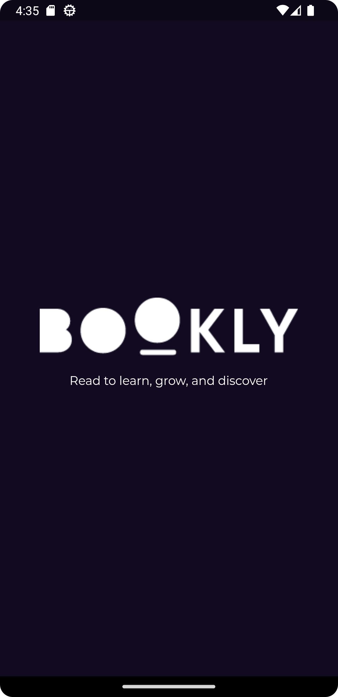
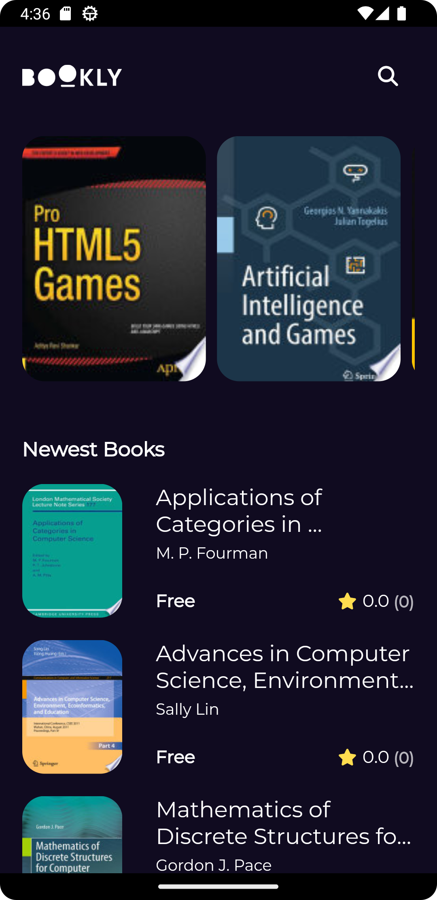
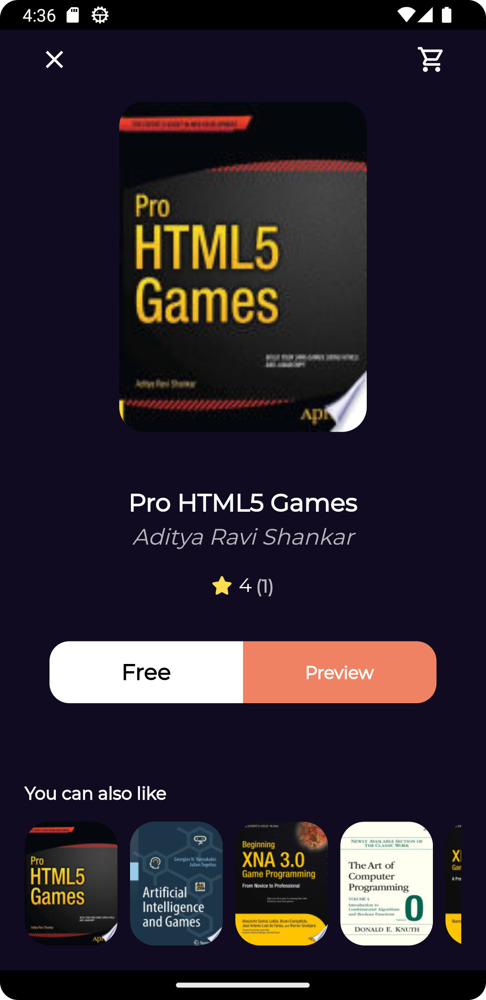
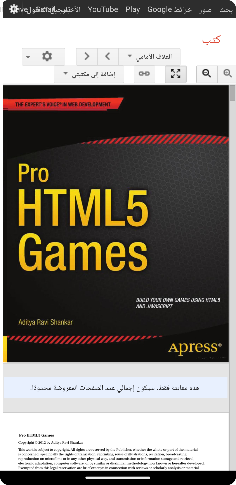
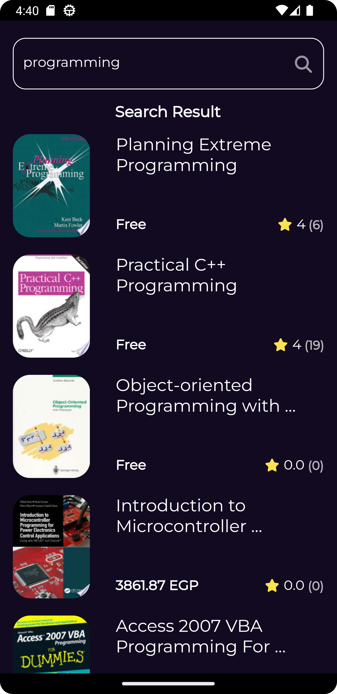

# 🔥 Flutter E-Books App

[//]: # (details such as flutter sdk version, dart version, etc.)

## 📝 Description :

    Flutter SDK Version : 3.10.0
    Dart Version : 3.0.0

## ✨ Features :

- Clean Architecture.
- Bloc State Management.
- Google books API
- Search Debounce.
- Pagination.
- SOLID Principles
- Clean Code
- GoRouter
- Responsive UI.
- and more...

## 📹 Video Demo : [Flutter E-Books App](https://drive.google.com/file/d/1cJ5ylwpIBnpYGZ41cNBrOhLN292fPJnt/view?usp=sharing)

## 📸 Screenshots :

  
 
